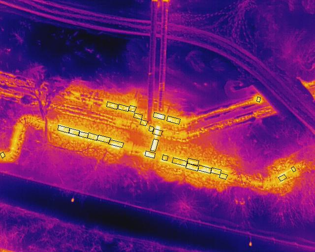
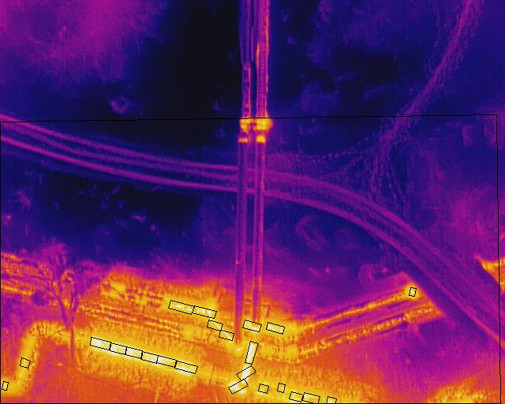
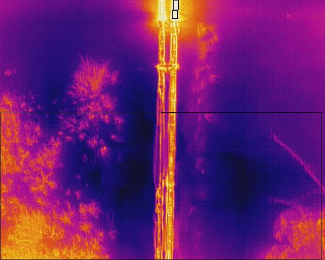
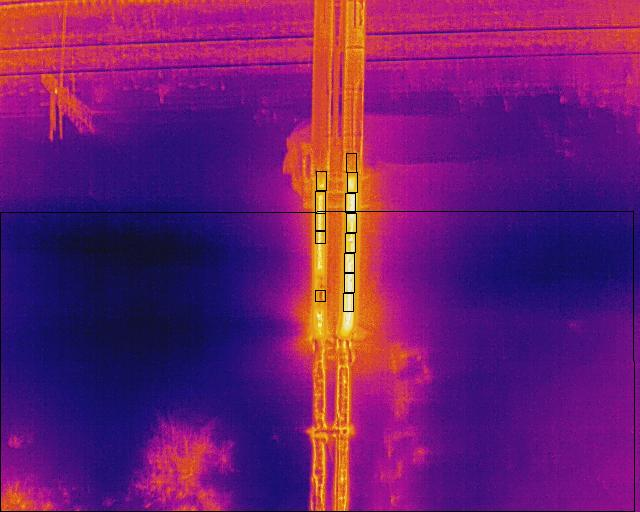
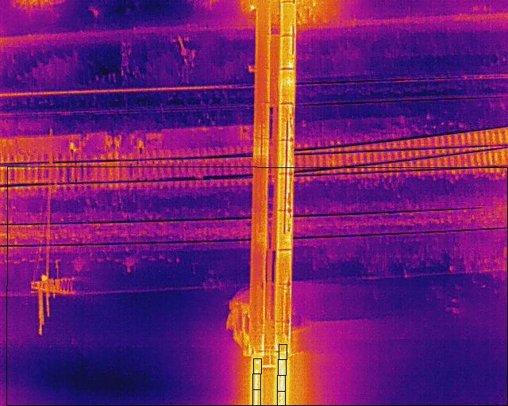
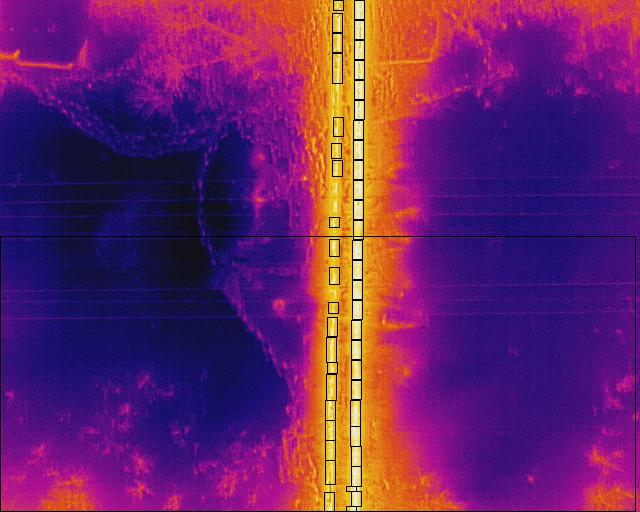
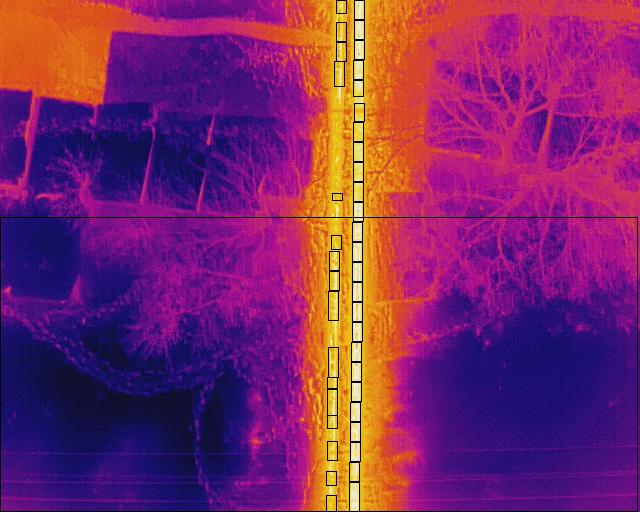
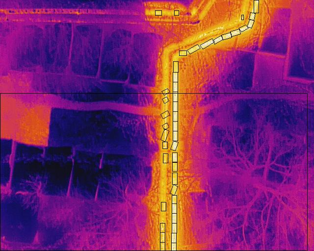
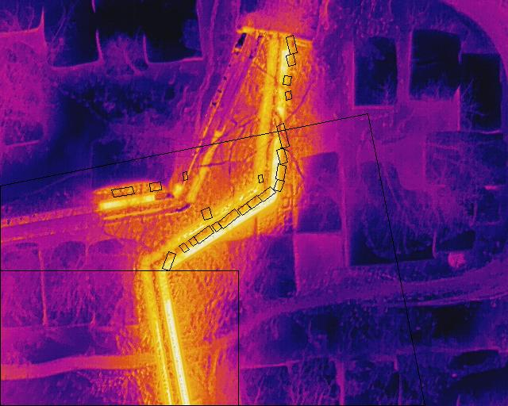

# Heating Systems Defects Detection on Thermograms

Репозиторий содержит программу, которая выделяет дефекты тепловых сетей (т. е. зоны разрушения теплоизоляционного слоя) на термограммах, сделанных БПЛА, а также производит подсчёт их площадей. Для сборки проекта используется сборщик Gradle.

Конкретнее, программа выделяет дефекты в виде прямоугольников, чьи стороны *примерно* параллельны сторонам трубы. Программа также вычисляет площади дефектов, причём под площадью дефекта подразумевается не площадь прямоугольника, а площадь участка цилиндрической поверхности трубы, чьей проекцией он является. Площади считаются с учётом того факта, что соседние термограммы могут накладываться друг на друга.

Программа использует скрипты, которые извлекают из термограмм различные EXIF-параметры и необработанные температурные данные. Скрипты написаны для Windows и Linux; они самодостаточны, и их можно использовать независимо от программы.

## Описание файлов и скриптов

Все скрипты необходимо запускать из директории, содержащей файл `config.txt`. Кроме этого, перед запуском `thermograms_raw_temperatures.[bat/sh]` нужно убедиться, что упомянутая выше директория содержит скрипт `raw.[bat/sh]` и папку `SUBDIR_RAW_TEMPS`.

Файл `config.txt` содержит различные параметры, а именно:
- характеристики съёмки (шаг пикселя, главная точка снимка);
- диаметр трубы;
- температурный диапазон (минимальная и максимальная температуры), который означает наличие дефекта;
- параметры, используемые при окаймлении дефектов прямоугольниками и нахождении углов наклона трубы;
- прочие параметры, в числе которых упомянутые ниже `DIR_THERMOGRAMS`, `SUBDIR_OUTPUT`, `SUBDIR_DEFECTS`, `SUBDIR_RAW_TEMPS`, `SUBDIR_REAL_TEMPS`, 
`POSTFIX_RAW_TEMPS`, `POSTFIX_DEFECTS`.

Файл `custom_pipe_angles.txt` содержит массив в формате JSON, каждый элемент которого содержит название термограммы и список углов. Сначала любой дефект выделяется ломаной линией. Затем вычисляется угол наклона трубы в районе этого дефекта. Это нужно для того, чтобы дефекты выделялись прямоугольниками, параллельными трубе. Углы наклона трубы зачастую вычисляются с ошибками. Чтобы минимизировать число ошибок, необходима корректировка, которая заключается в следующем: в качестве угла наклона трубы берётся ближайший угол к значениям 0&deg; и 90&deg;, но если термограмма присутствует в файле, то наиболее близкий угол ищется среди углов из этого списка. (Углы на термограмме отсчитываются от направления вправо против часовой стрелки и принадлежат промежутку от 0&deg; до 180&deg; (верхняя граница исключается).)

Файл `forbidden_zones.txt` содержит массив в формате JSON, каждый элемент которого содержит название термограммы и список прямоугольников, в которых не нужно искать дефекты. (Прямоугольники задаются парой противоположных вершин, левой нижней и правой верхней, в пиксельной системе координат, где начало отсчёта &mdash; левый нижний угол термограммы, ось абсцисс направлена вдоль нижней стороны термограммы, а ось ординат &mdash; вдоль левой её стороны.)

Ниже представлено описание скриптов для Windows (описание скриптов для Linux аналогично).

```
Usage: global_params.bat

Извлекает общие для всех термограмм параметры: Focal Length, Planck R1, Planck R2, Planck O, Planck B, 
Planck F, emissivity, Reflected Apparent Temperature, Raw Thermal Image Height, Raw Thermal Image Width 
- из данных EXIF первой термограммы из папки DIR_THERMOGRAMS в файл .\SUBDIR_OUTPUT\global_params.txt в 
формате JSON.
```

```
Usage: thermograms_info.bat

Извлекает параметры термограмм из папки DIR_THERMOGRAMS: Relative Altitude, Gimbal Yaw Degree, GPS 
Latitude, GPS Longitude - из данных EXIF в файл .\SUBDIR_OUTPUT\thermograms_info.txt в виде массива JSON.
```

```
Usage: thermograms_raw_temperatures.bat

Извлекает из всех термограмм из папки DIR_THERMOGRAMS необработанные температурные данные в файлы в папке
.\SUBDIR_RAW_TEMPS.
```

```
Usage: raw.bat %1 %2

Извлекает из указанной термограммы необработанные температурные данные в файл 
<thermogram_name>POSTFIX_RAW_TEMPS.pgm в указанной папке.

  %1         термограмма
  %2         папка, содержащая файл с необработанными температурными данными термограммы
```

```
Usage: copy_gps.bat

Копирует EXIF-параметры термограмм из папки DIR_THERMOGRAMS: GPS Latitude, GPS Longitude - в данные
EXIF картинки с дефектами .\SUBDIR_DEFECTS\<thermogram_name>POSTFIX_DEFECTS.jpg.
```

## Запуск из командной строки

* Клонировать репозиторий:

```
> git clone https://github.com/ShikhovRuslan/defects_detection_on_thermograms.git
```

* Из корневой директории проекта выполнить следующую команду, чтобы создать консольное приложение defects:

```
> gradle jar
```

* Скопировать файл `defects.jar` в каталог, который содержит:
  - все 5 скриптов (с расширением `.bat` для Windows и `.sh` для Linux);
  - папки `SUBDIR_RAW_TEMPS`, `SUBDIR_REAL_TEMPS`, `SUBDIR_AUXILIARY`, `SUBDIR_RAW_DEFECTS` и `SUBDIR_DEFECTS`;
  - файлы `angles.txt`, `pipe_angles_log.txt` и `squares.txt` в папке `SUBDIR_AUXILIARY`;
  - файлы `config.txt`, `custom_pipe_angles.txt`, `forbidden_zones.txt` и `help.txt`.

В файле `config.txt` нужно заполнить параметр `DIR_THERMOGRAMS` (папка с термограммами), а также, в случае использования Windows, необходимо указать путь к программам ExifTool и sed в одноимённых параметрах.

* Запустить файл `defects.jar` с первыми трёмя параметрами и, дождавшись окончания работы скриптов, последовательно запустить с оставшимися двумя 
параметрами.

```
Usage: java -jar defects.jar [-gp | -ti | -trt | -csv | -d]

  -gp        Запускает global_params.[bat/sh].
  -ti        Запускает thermograms_info.[bat/sh].
  -trt       Запускает thermograms_raw_temperatures.[bat/sh].
  -csv       Для каждой термограммы из папки DIR_THERMOGRAMS конвертирует файл с необработанными 
             температурными данными из папки .\SUBDIR_RAW_TEMPS в файл с температурами в формате CSV 
             в папке .\SUBDIR_REAL_TEMPS.
  -d         Для каждой термограммы из файла .\SUBDIR_OUTPUT\thermograms_info.txt создаёт изображение с 
             выделенными дефектами в папке .\SUBDIR_DEFECTS.
             Запускает copy_gps.[bat/sh].
```

* Картинки с выделенными дефектами сохраняются в папке `.\SUBDIR_DEFECTS`, а их площади &mdash; в файле `.\SUBDIR_OUTPUT\pipe_squares.txt`.

## Результаты

Для термограмм из папки `sample_thermograms` программа даёт следующий результат. (Минимальная температура равна 30 &deg;C, а максимальная &mdash; 100 &deg;C.)
| Термограмма | Площадь дефектов, м<sup>2</sup> |
| :---        | :----:                          |
| DJI_0319_R | 75.96 |
| DJI_0321_R | 0     |
| DJI_0323_R | 0     |
| DJI_0325_R | 0     |
| DJI_0327_R | 0     |
| DJI_0329_R | 5.11  |
| DJI_0331_R | 14.1  |
| DJI_0333_R | 0     |
| DJI_0335_R | 75.12 |
| DJI_0337_R | 53.05 |
| DJI_0339_R | 41.59 |
| DJI_0341_R | 43.07 |
| DJI_0343_R | 8.54  |

Суммарная площадь дефектов составляет 316.53 м<sup>2</sup>.

На картинках выделены дефекты теплосети, а также зоны перекрытия соседних термограмм. На второй термограмме присутствуют дефекты, но площадь равна 0. Это из-за того, что все эти дефекты попали в зону перекрытия этой термограммы и предыдущей (т. е. их площадь уже учтена на первой термограмме). На последней картинке также выделен прямоугольник, в котором не нужно искать дефекты.

<p>
  
   
  
  
  
  
  
  
   
  
  
  
  
</p>
